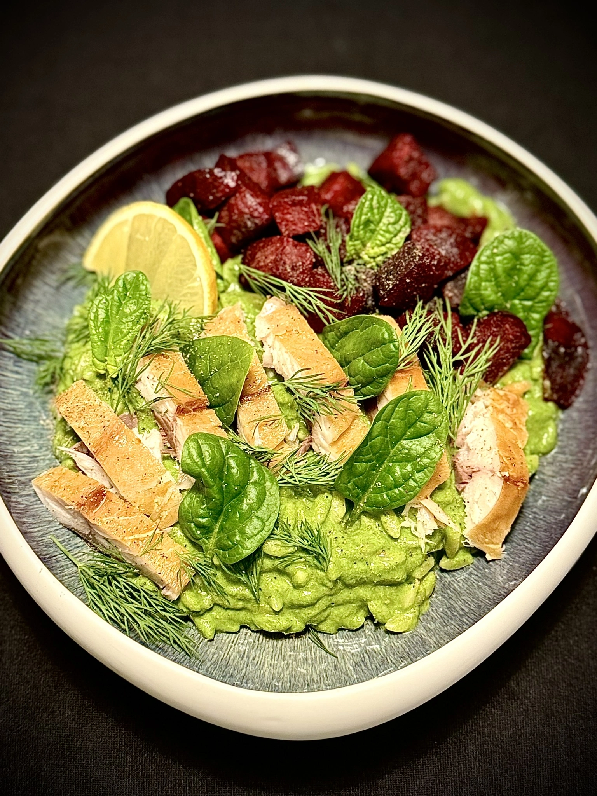
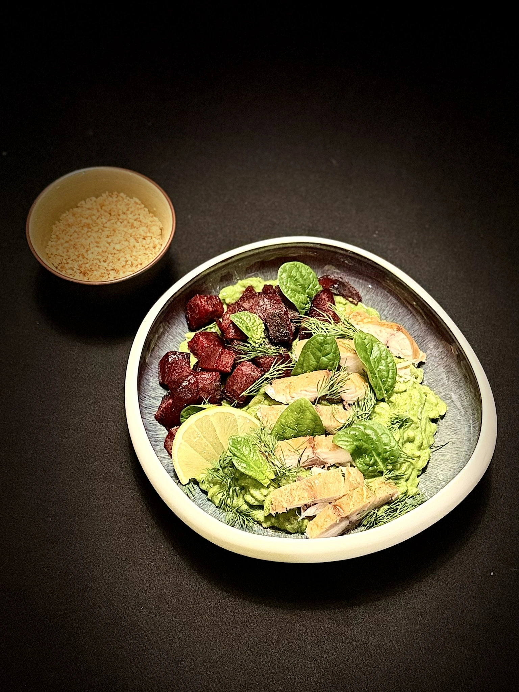

## Ingrédients

Est-ce que vous le méritez?

Un petit teaser.

### Pour le croustillant  au ponko:
- 25 gr de ponkon fin (ou mixé)
- 1 citron vert
- 1 gousse d'ail
- Poivre noir
- Sel

### Recette :
 - Faire chauffer une huile neutre dans une poele.
 - Faire revenir le ponkon dans la poele chaude
 - Ajouter l'ail, zester le citron, le poivre noir et le sel.
 - Stopper la préparation quand elle a une belle coloration comme sur la photo. Laissez refroidire.

