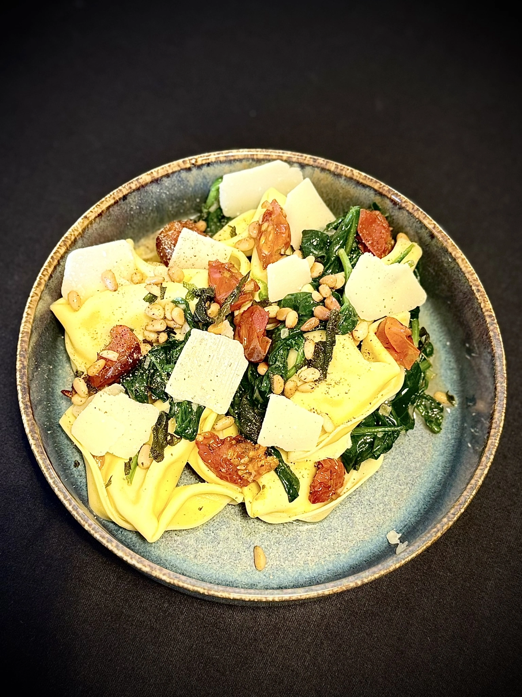

## Ingrédients

1 gousse d'ail
1 échalote
300gr épinards
50gr Gran Moravia ou parmesan
30gr pignon de pin
1/2 sauge
175gr tomates cerises rouges
10 tortelloni frais cacio e pepe

## Préparation
1. Préchauffez le four à 220°C. Portez à ébullition une grande casserole d'eau salée pour les pâtes.

2. Tomates cerises cuites : versez un généreux filet d'huile d'olive dans un plat à four. Pressez-y l'ail, ajoutez les tomates cerises et le sucre brun. Assaisonnez avec des herbes de Provence, du sel et du poivre noir. Faites rôtir pendant 15-20 min au four.

3. Hachez finement l’échalote. Hachez finement la moitié du Gran Moravia.

4. Pignons de pin à la sauge : détachez les feuilles des brins. Hachez les feuilles de sauge en fines lamelles tout en gardant quelques feuilles pour la finition. Faites fondre la quantité indiquée de beurre et d'huile d'olive dans une grande poêle. Faites sauter les pignons de pin, les lamelles de sauge et les feuilles de sauge à feu moyen, jusqu'à ce que le beurre brunisse et dégage une légère odeur de noisette et que la sauge soit croustillante. Retirez de la poêle.

5. Faites fondre une noix de beurre dans la même poêle et faites revenir l’échalote pendant 2 min à feu doux. Ajoutez progressivement les épinards, une poignée à la fois, et laissez réduire. Assaisonnez de sel et de poivre noir.

6. Pendant ce temps, faites cuire les pâtes selon les instructions figurant sur l’emballage. Ajoutez 1 càs d’eau de cuisson par personne et le Gran Moravia finement haché aux épinards (voir astuce). Remuez bien jusqu’à ce que le fromage ait fondu. Ajoutez au besoin un supplément d’eau de cuisson.

7. Sortez délicatement les pâtes de l'eau à l'aide d'une écumoire et disposez dans une assiette creuse (comptez 5 pièces par personne).

8. Ajoutez les tomates cerises cuites et les épinards sur et à côté des pâtes. Versez la sauce de la poêle sur les pâtes. Terminez avec le reste du Gran Moravia, les pignons de pin à la sauge, les feuilles de sauge entières et une généreuse pincée de poivre. Bon appétit !

## Astuce
Utilisez le liquide de cuisson des pâtes pour obtenir la sauce parfaite. Commencez par une cuillerée à soupe par personne et ajoutez-en si nécessaire. Rien de tel pour que la sauce imprègne bien les tortelloni et obtenir un plat encore plus onctueux !
