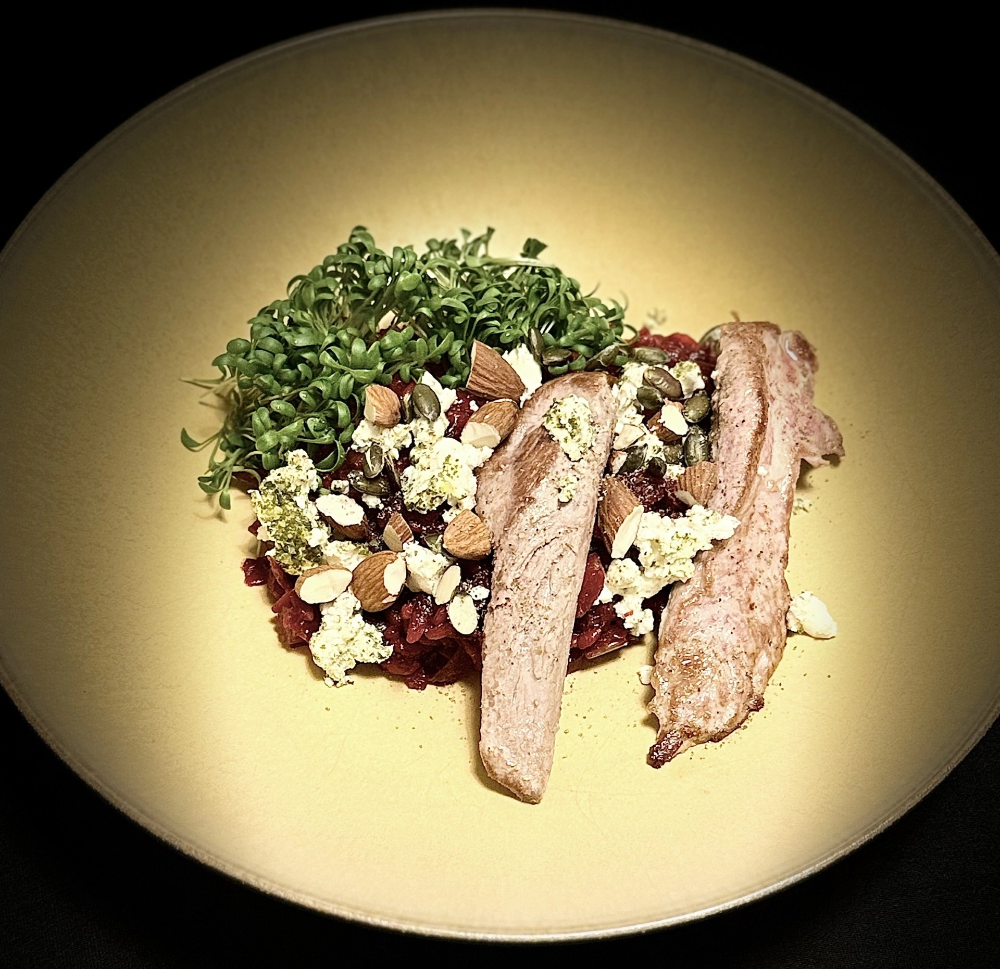

## Ingrédients

to be updated

### Pour la salade :
- 2 tomates mûres et fermes
- 1 concombre
- 1 oignon rouge
- 200g de feta
- 100g d'olives noires dénoyautées
- 1 poivron vert (facultatif)

### Pour la vinaigrette :
- 4 cuillères à soupe d'huile d'olive extra vierge
- 1 cuillère à soupe de jus de citron frais
- 1 cuillère à café d'origan séché
- 1 pincée de sel
- Poivre noir du moulin

## Instructions

### Préparation des légumes

1. **Couper les tomates** : Laver les tomates et les couper en quartiers ou en gros dés. Les placer dans un grand saladier.

2. **Préparer le concombre** : Couper le concombre en rondelles épaisses ou en demi-lunes. L'ajouter aux tomates.

3. **Émincer l'oignon** : Éplucher l'oignon rouge et l'émincer finement. Parsemer sur les légumes.

4. **Ajouter le poivron** (facultatif) : Couper le poivron en fines lamelles et les ajouter à la salade.

### Préparation de la vinaigrette

5. **Mélanger les ingrédients** : Dans un petit bol, fouetter l'huile d'olive, le jus de citron, l'origan, le sel et le poivre.

6. **Assaisonner** : Verser la vinaigrette sur les légumes et mélanger délicatement.

### Finition

7. **Ajouter la feta** : Couper la feta en gros cubes et les disposer sur le dessus de la salade. **Important** : ne pas mélanger la feta, elle doit rester visible sur le dessus !

8. **Ajouter les olives** : Répartir les olives noires sur la salade.

9. **Saupoudrer d'origan** : Finir par un généreux saupoudrage d'origan séché.

10. **Servir immédiatement** : La salade grecque se mange fraîche, juste après préparation.

## Conseils

> **Astuce de Lionel** : Pour une salade encore plus savoureuse, utilisez de la feta authentique grecque (DOP) et des olives kalamata. La qualité des ingrédients fait toute la différence !

> **Note d'Ophélie** : Cette salade se marie parfaitement avec du pain pita chaud et du houmous maison. Un déjeuner complet et équilibré !

## Variations

- **Version complète** : Ajoutez des pois chiches cuits pour plus de protéines
- **Version épicée** : Ajoutez quelques rondelles de piment frais
- **Version verte** : Remplacez les tomates par des feuilles de roquette

## Informations nutritionnelles (par portion)

| Élément | Valeur |
|---------|--------|
| Calories | ~280 kcal |
| Protéines | 10g |
| Glucides | 12g |
| Lipides | 22g |

---

*Kali orexi ! 🥗*
